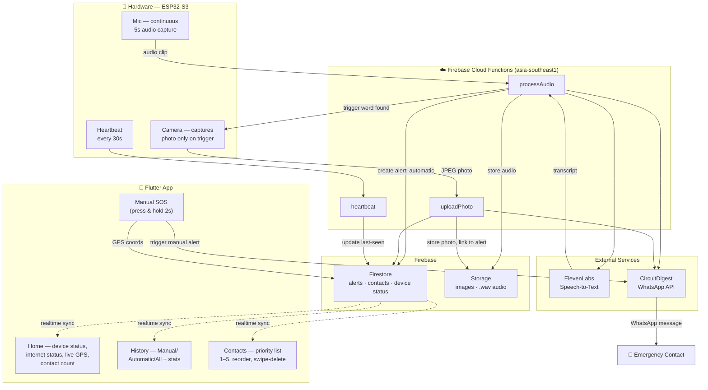
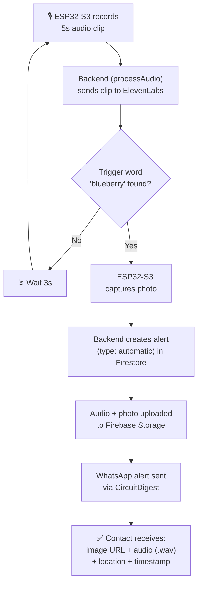
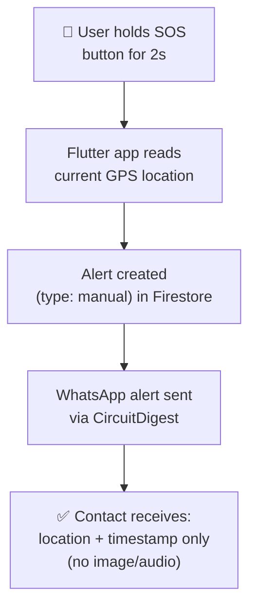

<div align="center">

# 🛡️ SheAlert

### A Women Safety Monitoring System — Voice-Triggered & Manual SOS with Live Evidence Capture


</div>

---

## 📖 1. Overview

**SheAlert** is a real-time women's safety monitoring system that combines a wearable/embedded hardware device with a mobile app to send emergency alerts through two modes:

- 🎙️ **Automatic Mode** — Continuously listens for a secret trigger word ("**blueberry**"). Once detected, it captures a photo, records audio evidence, and instantly notifies emergency contacts over WhatsApp with **location, timestamp, and evidence (image URL and audio `.wav` file)**.
- 🆘 **Manual Mode** — A press-and-hold SOS button in the companion Flutter app for situations where speed matters more than evidence, sending just live location and timestamp — it does not depend on the ESP32-S3 device at all, only on the phone's internet and GPS.

The system is designed around a simple principle: **automatic mode maximizes evidence, manual mode maximizes speed.**

---

## ✨ 2. Features

- 🔊 Continuous audio monitoring with wake-word detection (trigger word: `blueberry`)
- 📸 Automatic photo capture on trigger via onboard ESP32-S3 camera
- 🎤 Audio evidence recording (`.wav`) alongside every automatic alert
- 📍 Real-time GPS location tracking in the mobile app
- 📲 Instant WhatsApp alerts with image, audio, location & timestamp
- ⚡ One-touch **Manual SOS** (2-second press) for fast, evidence-free alerts, independent of the hardware device
- 💓 Heartbeat-based ESP32-S3 connectivity status, shown separately from the app's internet connectivity status
- 👥 Priority-ordered emergency contacts (up to 5, reorderable, swipe-to-delete with confirmation)
- 📊 Alert history with Manual / Automatic / All filters + weekly stats
- ☁️ Realtime sync between hardware, backend, and mobile app via Firebase

---

## 🛠️ 3. Tech Stack

| Layer | Technology | Purpose |
|---|---|---|
| **Hardware** | XIAO ESP32-S3 Sense (Camera + PDM Mic) | Captures audio continuously & photo on trigger |
| **Firmware** | Arduino (C++), `esp_camera`, `ESP_I2S` | Records audio, controls camera, sends heartbeat |
| **Backend** | Node.js (Firebase Cloud Functions) — `index.js` | Processes audio, manages alerts, uploads media |
| **Speech-to-Text** | ElevenLabs API | Converts recorded audio to text for trigger detection |
| **Database** | Firebase Firestore | Stores alerts (classified automatic/manual), contacts & device status |
| **File Storage** | Firebase Storage | Stores captured images & `.wav` audio files |
| **Notifications** | CircuitDigest Cloud API | Sends WhatsApp alerts to emergency contacts |
| **Mobile App** | Flutter (Dart) | Home, History, and Contacts management UI |
| **Realtime Sync** | Firebase Firestore listeners | Live device status & alert history updates |

---

## 🧩 4. System Architecture

### 4.1 Component Architecture



> The ESP32-S3 only feeds the automatic path — audio to `processAudio`, photo to `uploadPhoto` — while the Flutter app's manual SOS writes straight to Firestore and triggers the WhatsApp send on its own, with no dependency on the hardware device. The app's Home, History, and Contacts pages all stay in sync via Firestore listeners.

### 4.2 Alert Flow — Automatic Mode



### 4.3 Alert Flow — Manual Mode



> **Why two modes?** Automatic mode takes longer since it waits on audio recording, transcription, and photo/audio upload — but produces stronger evidence. Manual mode skips all of that and doesn't touch the ESP32-S3 at all, only needing the phone's internet and GPS, for near-instant delivery when every second counts. Each automatic listening cycle records for **5 seconds**, transcribes and checks for the trigger word, and if not found, **waits 3 seconds** before starting the next cycle.

---

## 🔩 5. Core Modules

### 5.1 Hardware — XIAO ESP32-S3 Sense

| Component | Detail |
|---|---|
| Microcontroller | ESP32-S3 (XIAO Sense variant) |
| Microphone | PDM mic via `ESP_I2S` — Clock: GPIO 42, Data: GPIO 41 |
| Camera | OV-series camera module (JPEG, VGA resolution, quality 12) |
| Sample Rate | 16 kHz, mono, 16-bit |
| Recording Window | 5 seconds per listening cycle, with a 3-second pause before the next cycle if no trigger word is found |
| Connectivity | Wi-Fi (HTTPS to Firebase Cloud Functions) |
| Heartbeat Interval | Every 30 seconds |

### 5.2 Backend — `index.js` (Firebase Cloud Functions, `asia-southeast1`)

| Endpoint | Responsibility |
|---|---|
| `processAudio` | Receives `.wav` audio, sends to ElevenLabs STT, checks for trigger word, creates alert in Firestore, stores audio in Storage, and triggers the WhatsApp alert via CircuitDigest |
| `uploadPhoto` | Receives JPEG photo, stores in Firebase Storage, links to alert, triggers WhatsApp send with the photo |
| `heartbeat` | Updates ESP32-S3's "last seen" timestamp in Firestore for online/offline status |

### 5.3 Mobile App — Flutter

| Page | Functionality |
|---|---|
| **Home** | Top banner shows **Connected / Disconnected** based on the phone's **internet connectivity** (so the user always knows if at least manual alerts can go through); separately reflects **ESP32-S3 device status** via its heartbeat; also shows live GPS location (updates only while online), current contact count, and the manual SOS button |
| **History** | Alert log filtered by Manual / Automatic / All, with total alerts & this-week stats |
| **Contacts** | Add, reorder (priority 1–5), and remove (swipe-to-delete with confirmation) emergency contacts |

---

## 📁 6. Project Structure

```
SheAlert/
├── firmware/
│   └── shealert_esp32s3/
│       └── shealert_esp32s3.ino        # Arduino firmware (mic + camera + heartbeat)
├── backend/
│   ├── index.js                        # Firebase Cloud Functions (processAudio, uploadPhoto, heartbeat)
│   ├── package.json
│   └── .env                            # API keys (ElevenLabs, CircuitDigest) — not committed
├── mobile_app/
│   └── shealert_flutter/
│       ├── lib/
│       │   ├── pages/
│       │   │   ├── home_page.dart
│       │   │   ├── history_page.dart
│       │   │   └── contacts_page.dart
│       │   └── main.dart
│       └── pubspec.yaml
├── docs/
│   └── screenshots/
└── README.md
```

> ⚠️ I don't have access to your actual repo, so I can't verify this tree matches. If you paste your real folder listing (e.g. `tree -L 3` output) or upload the repo, I'll check it against this and correct any mismatches.

---

## 📸 7. Screenshots / Demo

<!-- Add screenshots here: Home page (connected & disconnected states), History page, Contacts page, backend logs/console, and WhatsApp notification screenshots for both manual and automatic alerts -->

| Home (Connected) | Home (Disconnected) | History Page | Contacts Page |
|---|---|---|---|
| _add screenshot_ | _add screenshot_ | _add screenshot_ | _add screenshot_ |

| Backend Logs | WhatsApp Alert (Manual) | WhatsApp Alert (Automatic) |
|---|---|---|
| _add screenshot_ | _add screenshot_ | _add screenshot_ |

---

## 📊 8. Results

<!--
How to measure end-to-end latency when it's under a minute:
Report it in seconds, not forced into a minute format — e.g. "~38s avg" rather than "0.63 min".
To get real numbers, log a server timestamp at each stage and take the delta:
  1. t0 = ESP32-S3 starts recording (or manual SOS button press)
  2. t1 = processAudio (or manualAlert path) receives the request
  3. t2 = ElevenLabs transcript returned (automatic only)
  4. t3 = Firestore alert document created
  5. t4 = CircuitDigest WhatsApp API call returns success
Compute (t4 - t0) in milliseconds, convert to seconds, and average over ~10–15 trials for each mode.
Firestore server timestamps (FieldValue.serverTimestamp()) avoid clock-drift issues between device/backend/phone.
-->

- Average time from trigger word → WhatsApp alert (automatic mode): `TBD`
- Average time for manual SOS delivery: `TBD`
- Trigger word detection accuracy (test runs): `TBD`
- Device uptime / heartbeat reliability: `TBD`

---

## 🎯 9. Key Learnings

- Streaming and buffering audio from the ESP32-S3's PDM mic via `ESP_I2S` in fixed 5-second windows, and the trade-offs of that window size between responsiveness and transcription accuracy
- Designing for two very different latency budgets in one app — automatic mode optimized for evidence richness, manual mode optimized for raw speed — and making that trade-off explicit in the UX rather than hiding it
- Working with Firebase Cloud Functions regions (`asia-southeast1`) and structuring endpoints (`processAudio`, `uploadPhoto`, `heartbeat`) around distinct hardware/app triggers instead of one monolithic function
- Integrating third-party APIs (ElevenLabs STT, CircuitDigest WhatsApp) into a real-time pipeline, including handling their failure modes without blocking the alert flow
- Using Firestore listeners for realtime sync across three independent surfaces (Home, History, Contacts) so the app reflects hardware and backend state changes without polling
- Distinguishing "device connectivity" (ESP32-S3 heartbeat) from "app connectivity" (phone's internet) as two separate signals, since manual SOS only needs the latter

---

## 🚀 10. Future Improvements

- 🔋 Battery-optimized / low-power listening mode for the ESP32-S3
- 🗣️ On-device wake-word detection to reduce cloud STT calls
- 🌐 Offline SMS fallback when there's no internet connectivity
- 🧭 Geofencing-based automatic alerts (e.g., unsafe zone detection)
- 📈 Analytics dashboard for alert trends over time
- 🔐 Add user authentication (currently single-user, no login)

---

## 🙋 Author

**Thirumalai Subashree**
