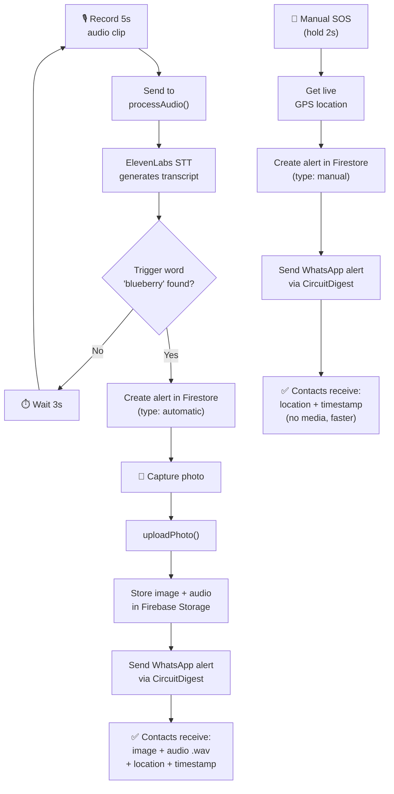

<div align="center">

# 🛡️ SheAlert

### A Women Safety Monitoring System — Voice-Triggered & Manual SOS with Live Evidence Capture


</div>

---

## 📖 1. Overview

**SheAlert** is a real-time women's safety monitoring system that combines a wearable/embedded hardware device with a mobile app to send emergency alerts through two modes:

- 🎙️ **Automatic Mode** — Continuously listens for a secret trigger word ("**blueberry**"). Once detected, it captures a photo, records audio evidence, and instantly notifies emergency contacts over WhatsApp with **location, timestamp, and evidence** (image URL and audio `.wav` file).
- 🆘 **Manual Mode** — A press-and-hold SOS button in the companion Flutter app for situations where speed matters more than evidence, sending just live location and timestamp.

The system is designed around a simple principle: **automatic mode maximizes evidence, manual mode maximizes speed.**

---

## ✨ 2. Features

- 🔊 Continuous audio monitoring with wake-word detection (trigger word: `blueberry`)
- 📸 Automatic photo capture on trigger via onboard ESP32-S3 camera
- 🎤 Audio evidence recording (`.wav`) alongside every automatic alert
- 📍 Real-time GPS location tracking in the mobile app
- 📲 Instant WhatsApp alerts with image, audio, location & timestamp
- ⚡ One-touch **Manual SOS** (2-second press) for fast, evidence-free alerts
- 💓 Heartbeat-based device connectivity status (device online/offline)
- 👥 Priority-ordered emergency contacts (up to 5, reorderable, swipe-to-delete with confirmation)
- 📊 Alert history with Manual / Automatic / All filters + weekly stats
- ☁️ Realtime sync between hardware, backend, and mobile app via Firebase

---

## 🛠️ 3. Tech Stack

| Layer | Technology | Purpose |
|---|---|---|
| **Hardware** | XIAO ESP32-S3 Sense (Camera + PDM Mic) | Captures audio continuously & photo on trigger |
| **Firmware** | Arduino (C++), `esp_camera`, `ESP_I2S` | Records audio, controls camera, sends heartbeat |
| **Backend** | Node.js (Firebase Cloud Functions) — `functions/index.js` | Processes audio, manages alerts, uploads media |
| **Speech-to-Text** | ElevenLabs API | Converts recorded audio to text for trigger detection |
| **Database** | Firebase Firestore | Stores alerts (classified automatic/manual) & contacts |
| **File Storage** | Firebase Storage | Stores captured images & `.wav` audio files |
| **Notifications** | CircuitDigest Cloud API | Sends WhatsApp alerts to emergency contacts |
| **Mobile App** | Flutter (Dart) — `lib/screens/` | Home, History, and Contacts management UI |
| **Realtime Sync** | Firebase Firestore listeners | Live device status & alert history updates |

---

## 🧩 4. System Architecture

### 4.1 Component Architecture

<div align="center">


</div>

Both alert paths run independently and converge on the same Firebase + WhatsApp backend:

- **Automatic path** (teal): the ESP32-S3 records audio and photo → `processAudio()` transcribes and checks for the trigger word → `uploadPhoto()` stores the evidence and notifies contacts.
- **Manual path** (orange): the Flutter app captures a 2-second SOS hold → fetches a live GPS fix → sends the alert straight to the backend, skipping evidence capture for speed.
- **Shared backend** (gray): Firestore holds alerts and contacts, Storage holds images/audio, and CircuitDigest delivers everything over WhatsApp.

### 4.2 Alert Flow — Automatic vs Manual



> **Why two modes?** Automatic mode takes longer since it waits on audio recording, transcription, and photo upload — but produces stronger evidence. Manual mode skips all of that for near-instant delivery when every second counts. If no trigger word is found in a 5s clip, the device waits 3s before starting the next recording cycle.

---

## 🔩 5. Core Modules

### 5.1 Hardware — XIAO ESP32-S3 Sense

| Component | Detail |
|---|---|
| Microcontroller | ESP32-S3 (XIAO Sense variant) |
| Microphone | PDM mic via `ESP_I2S` — Clock: GPIO 42, Data: GPIO 41 |
| Camera | OV-series camera module (JPEG, VGA resolution, quality 12) |
| Sample Rate | 16 kHz, mono, 16-bit |
| Recording Window | 5 seconds per listening cycle, 3s pause between cycles if no trigger |
| Connectivity | Wi-Fi (HTTPS to Firebase Cloud Functions) |
| Heartbeat Interval | Every 30 seconds |

### 5.2 Backend — `functions/index.js` (Firebase Cloud Functions, `asia-southeast1`)

| Endpoint | Responsibility |
|---|---|
| `processAudio` | Receives `.wav` audio, sends to ElevenLabs STT, checks for trigger word, creates alert, stores audio in Storage, sends audio via CircuitDigest |
| `uploadPhoto` | Receives JPEG photo, stores in Firebase Storage, links to alert, triggers WhatsApp image send via CircuitDigest |
| `heartbeat` | Updates device "last seen" timestamp in Firestore for online/offline status |

### 5.3 Mobile App — Flutter

| Page | Functionality |
|---|---|
| **Home** | Connection status (device + internet), live GPS location, contact count, manual SOS button |
| **History** | Alert log filtered by Manual / Automatic / All, with total alerts & this-week stats |
| **Contacts** | Add, reorder (priority 1–5), and remove (swipe-to-delete with confirmation) emergency contacts |

---

## 📁 6. Project Structure

```
SheAlert/
├── she_alert_app/                      # Flutter mobile app
│   ├── android/
│   ├── assets/
│   ├── lib/
│   │   ├── models/
│   │   ├── screens/
│   │   │   ├── home_screen.dart
│   │   │   ├── history_screen.dart
│   │   │   └── contacts_screen.dart
│   │   ├── services/
│   │   ├── theme/
│   │   ├── widgets/
│   │   ├── firebase_options.dart
│   │   └── main.dart
│   ├── test/
│   ├── web/
│   ├── .firebaserc
│   ├── firebase.json
│   ├── pubspec.yaml
│   └── pubspec.lock
├── she_alert_backend/                  # Firebase Cloud Functions
│   ├── functions/
│   │   ├── index.js                    # processAudio, uploadPhoto, heartbeat
│   │   ├── package.json
│   │   └── .env                        # API keys (ElevenLabs, CircuitDigest) — not committed
│   ├── .firebaserc
│   └── firebase.json
├── she_alert_firmware/                 # Arduino firmware
│   └── shealertfirmware.ino
├── docs/
│   └── screenshots/
│       └── architecture.svg
└── README.md
```

> Verified against the actual VSCode workspace — the three components (`she_alert_app`, `she_alert_backend`, `she_alert_firmware`) sit directly at the project root, and Cloud Functions code correctly lives inside `she_alert_backend/functions/`. Build artifacts, IDE files (`.dart_tool`, `.idea`, `build`, `.metadata`), lockfiles, and local testing/seed scripts (`harness.js`, `seed.js`, `emulator-data/`) are omitted here for clarity since they're either generated or dev-only.

---

## 📸 7. Screenshots / Demo

### 📱 App

| Home (Connected) | Home (Disconnected) | History | Contacts |
|---|---|---|---|
| _add screenshot_ | _add screenshot_ | _add screenshot_ | _add screenshot_ |

### ☁️ Backend

_add Firebase console / Cloud Functions logs screenshots here_

### 💬 WhatsApp Notifications

| Automatic Alert | Manual Alert |
|---|---|
| _add screenshot_ | _add screenshot_ |

---

## 🎯 8. Key Learnings

- ⚖️ **Evidence vs. speed tradeoff** — designing two distinct alert paths (rich evidence vs. near-instant delivery) instead of one-size-fits-all, since emergency UX has to account for both "I need proof" and "I need help now" scenarios.
- 🎙️ **I2S/PDM microphone streaming on ESP32-S3** — capturing clean 16kHz mono audio continuously without blocking the camera or Wi-Fi stack.
- ☁️ **Chaining cloud STT into a trigger-word pipeline** — using ElevenLabs for transcription instead of on-device wake-word detection meant handling network latency, retries, and cost per call rather than running inference locally.
- 🔗 **Multi-service orchestration** — coordinating a single alert event across ESP32 firmware, Cloud Functions, Firestore, Storage, and a third-party WhatsApp API without losing consistency if any one step fails.
- 💓 **Heartbeat pattern for device presence** — using periodic pings + Firestore timestamps to derive "online/offline" state instead of relying on a persistent connection.
- 🌍 **Firebase Cloud Functions regions** — deploying to `asia-southeast1` and how region choice affects latency for both the device and the mobile app's realtime listeners.
- 🔐 **Handling third-party API keys safely** — keeping ElevenLabs and CircuitDigest credentials out of the firmware and mobile app, isolated inside Cloud Functions via `.env`.
- 🧠 **Designing against false triggers** — using a hold-to-confirm (2s) gesture for manual SOS and a fixed trigger phrase for automatic mode, both aimed at reducing accidental alerts in a safety-critical context.

---

## 🚀 9. Future Improvements

- 🔐 Add user authentication (currently single-user, no login)
- 🔋 Battery-optimized / low-power listening mode for the ESP32-S3
- 🗣️ On-device wake-word detection to reduce cloud STT calls
- 🌐 Offline SMS fallback when there's no internet connectivity
- 🧭 Geofencing-based automatic alerts (e.g., unsafe zone detection)
- 📈 Analytics dashboard for alert trends over time

---

## 🙋 Author

Your Name — [GitHub](https://github.com/username)
