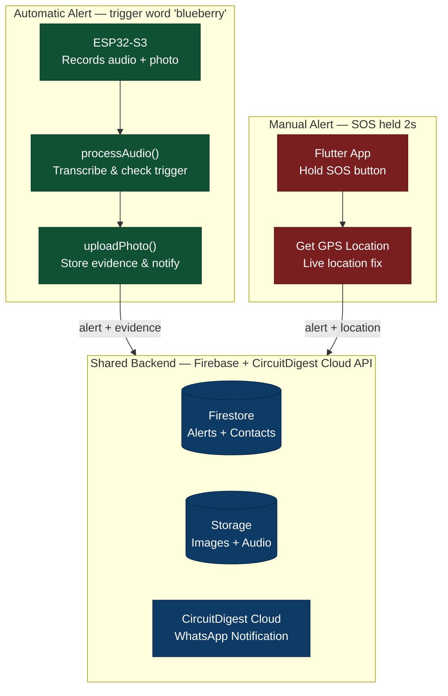

<div align="center">

# 🛡️ SheAlert


### *Your Safety, Your Control*

A Women Safety Monitoring System — Voice-Triggered & Manual SOS with Live Evidence Capture


</div>

---

## 📖 1. Overview

**SheAlert** is a real-time women's safety monitoring system that pairs an ESP32-S3 hardware device with a Flutter mobile app to send emergency alerts through two modes:

- 🎙️ **Automatic Mode** — Continuously listens for a secret trigger word (**"blueberry"**). Once detected, it captures a photo, records audio evidence, and instantly notifies emergency contacts over WhatsApp with **location, timestamp, and evidence** (image + `.wav` audio).
- 🆘 **Manual Mode** — A press-and-hold SOS button in the companion app for situations where speed matters more than evidence, sending just live location and timestamp.

The system is built around one principle: **automatic mode maximizes evidence, manual mode maximizes speed.**

---

## ✨ 2. Features

- Continuous audio monitoring with wake-word detection (trigger word: `blueberry`)
- Automatic photo + audio evidence capture on trigger, sent via WhatsApp with location & timestamp
- One-touch **Manual SOS** (2-second press) for fast, evidence-free alerts
- Heartbeat-based device connectivity status (device online/offline)
- Priority-ordered emergency contacts (up to 5, reorderable, swipe-to-delete)
- Alert history with Manual / Automatic / All filters + weekly stats

---

## 🛠️ 3. Tech Stack

| Layer | Technology | Purpose |
|---|---|---|
| **Hardware** | XIAO ESP32-S3 Sense (built-in mic + camera) | Captures audio continuously & photo on trigger |
| **Firmware** | C++ / Arduino, ESP32-S3 SDK | Records audio, controls camera, sends heartbeat over Wi-Fi |
| **Backend** | Node.js — Firebase Cloud Functions | Processes audio, manages alerts, uploads media |
| **Speech-to-Text** | ElevenLabs STT API | Converts recorded audio to text for trigger detection |
| **Database** | Firebase Firestore | Stores alerts (automatic/manual) & contacts |
| **File Storage** | Firebase Storage | Stores captured images & `.wav` audio files |
| **Notifications** | CircuitDigest Cloud API | Sends WhatsApp alerts to emergency contacts |
| **Mobile App** | Flutter (Dart) | Home, History, and Contacts management UI |
| **Realtime Sync** | Firebase Firestore listeners | Live device status & alert history updates |

---

## 🧩 4. System Architecture



### How it works

| Step | What happens |
|---|---|
| **1. Audio Monitor** | ESP32-S3 mic continuously captures 5s ambient audio clips |
| **2. STT + Trigger Check** | ElevenLabs converts speech to text; backend checks for "blueberry" |
| **3. Photo Capture** *(automatic only)* | On trigger, the onboard camera captures a photo |
| **4. Firebase Store** | Image, audio, alert type, location & timestamp are saved to Firestore/Storage |
| **5. WhatsApp Alert** | CircuitDigest Cloud sends the alert (with evidence, for automatic mode) to all emergency contacts |

If no trigger word is found in a 5s clip, the device waits 3s before starting the next listening cycle. Manual mode skips straight from SOS press → GPS fix → alert, so it doesn't wait on recording, transcription, or photo upload — trading evidence for speed.

---

## 🔩 5. Core Modules

### 5.1 Hardware — XIAO ESP32-S3 Sense

| Component | Detail |
|---|---|
| Microcontroller | ESP32-S3 (XIAO Sense variant) |
| Microphone | Built-in PDM mic |
| Camera | Built-in camera module |
| Power | USB power supply |
| Connectivity | Wi-Fi (HTTP client to Firebase Cloud Functions) |
| Heartbeat Interval | Every 30 seconds |

### 5.2 Backend — Firebase Cloud Functions

| Function | Responsibility |
|---|---|
| `processAudio` | Receives `.wav` audio, sends to ElevenLabs STT, checks for trigger word, creates alert, stores audio in Storage, sends audio via CircuitDigest |
| `uploadPhoto` | Receives JPEG photo, stores in Firebase Storage, links to alert, triggers WhatsApp image send via CircuitDigest |
| `heartbeat` | Updates device "last seen" timestamp in Firestore for online/offline status |

### 5.3 Mobile App — Flutter

| Screen | Functionality |
|---|---|
| **Home** | Connection status (device + internet), live GPS location, contact count, manual SOS button |
| **History** | Alert log filtered by Manual / Automatic / All, with total alerts & this-week stats |
| **Contacts** | Add, reorder (priority 1–5), and remove (swipe-to-delete with confirmation) emergency contacts |

---

## 📁 6. Project Structure

```
SheAlert/
├── she_alert_app/                      # Flutter mobile app
│   ├── lib/
│   │   ├── models/
│   │   ├── screens/
│   │   │   ├── home_screen.dart
│   │   │   ├── history_screen.dart
│   │   │   └── contacts_screen.dart
│   │   ├── services/
│   │   ├── theme/
│   │   ├── widgets/
│   │   ├── firebase_options.dart
│   │   └── main.dart
│   ├── android/
│   ├── assets/
│   ├── pubspec.yaml
│   ├── firebase.json
│   └── .firebaserc
│
├── she_alert_backend/                  # Firebase Cloud Functions
│   ├── functions/
│   │   └── index.js                    # processAudio, uploadPhoto, heartbeat
│   ├── firebase.json
│   └── .firebaserc
│
├── she_alert_firmware/                 # ESP32-S3 firmware
│   └── shealertfirmware.ino
│
└── README.md
```

---

## 📸 7. Screenshots / Demo

### 📱 App

| Home (Connected) | Home (Disconnected) | History | Contacts |
|---|---|---|---|
| _add screenshot_ | _add screenshot_ | _add screenshot_ | _add screenshot_ |

### ☁️ Backend

_add Firebase console / Cloud Functions logs screenshots here_

### 💬 WhatsApp Notifications

| Automatic Alert | Manual Alert |
|---|---|
| _add screenshot_ | _add screenshot_ |

---

## 🎯 8. Key Learnings

- **Real-time audio streaming on ESP32-S3** — capturing continuous mic audio without blocking the camera/Wi-Fi tasks on the same chip
- **Designing for a trade-off, not just a feature** — automatic vs. manual mode forced explicit decisions about evidence vs. speed in an emergency UX
- **Wiring third-party APIs into one pipeline** — chaining ElevenLabs STT → Firestore → Storage → CircuitDigest Cloud into a single reliable alert flow
- **Realtime state across three layers** — keeping hardware, backend, and the Flutter app in sync via Firestore listeners

---

## 🚀 9. Future Improvements

- 🔐 Add user authentication (currently single-user, no login)
- 🔋 Battery-optimized / low-power listening mode for the ESP32-S3
- 🗣️ On-device wake-word detection to reduce cloud STT calls
- 🌐 Offline SMS fallback when there's no internet connectivity
- 🧭 Geofencing-based automatic alerts (e.g., unsafe zone detection)
- 📈 Analytics dashboard for alert trends over time

---

## 🙋 Author

Your Name — [GitHub](https://github.com/username)
