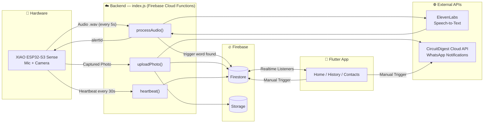
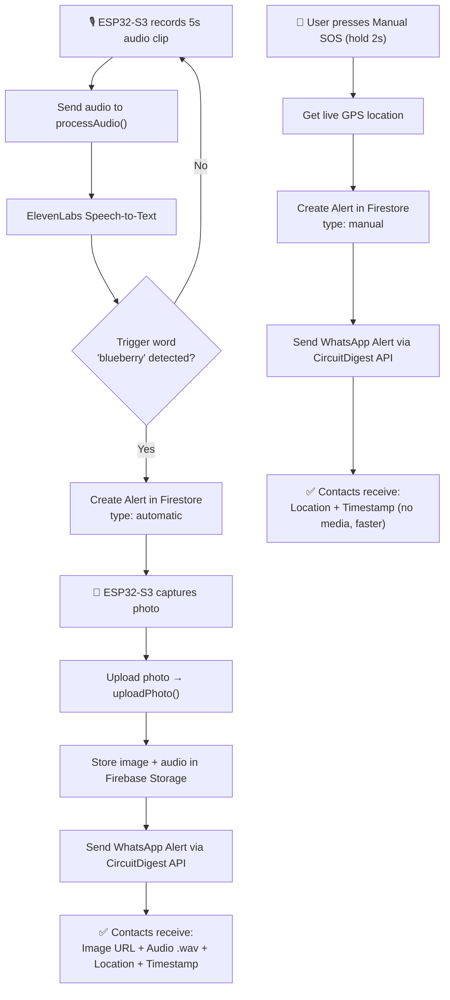

<div align="center">

# 🛡️ SheAlert

### A Women Safety Monitoring System — Voice-Triggered & Manual SOS with Live Evidence Capture


</div>

---

## 📖 1. Overview

**SheAlert** is a real-time women's safety monitoring system that combines a wearable/embedded hardware device with a mobile app to send emergency alerts through two modes:

- 🎙️ **Automatic Mode** — Continuously listens for a secret trigger word ("**blueberry**"). Once detected, it captures a photo, records audio evidence, and instantly notifies emergency contacts over WhatsApp with location and timestamp.
- 🆘 **Manual Mode** — A press-and-hold SOS button in the companion Flutter app for situations where speed matters more than evidence, sending just live location and timestamp.

The system is designed around a simple principle: **automatic mode maximizes evidence, manual mode maximizes speed.**

---

## ✨ 2. Features

- 🔊 Continuous audio monitoring with wake-word detection (trigger word: `blueberry`)
- 📸 Automatic photo capture on trigger via onboard ESP32-S3 camera
- 🎤 Audio evidence recording (`.wav`) alongside every automatic alert
- 📍 Real-time GPS location tracking in the mobile app
- 📲 Instant WhatsApp alerts with image, audio, location & timestamp
- ⚡ One-touch **Manual SOS** (2-second press) for fast, evidence-free alerts
- 💓 Heartbeat-based device connectivity status (device online/offline)
- 👥 Priority-ordered emergency contacts (up to 5, reorderable, swipe-to-delete with confirmation)
- 📊 Alert history with Manual / Automatic / All filters + weekly stats
- ☁️ Realtime sync between hardware, backend, and mobile app via Firebase

---

## 🛠️ 3. Tech Stack

| Layer | Technology | Purpose |
|---|---|---|
| **Hardware** | XIAO ESP32-S3 Sense (Camera + PDM Mic) | Captures audio continuously & photo on trigger |
| **Firmware** | Arduino (C++), `esp_camera`, `ESP_I2S` | Records audio, controls camera, sends heartbeat |
| **Backend** | Node.js (Firebase Cloud Functions) — `index.js` | Processes audio, manages alerts, uploads media |
| **Speech-to-Text** | ElevenLabs API | Converts recorded audio to text for trigger detection |
| **Database** | Firebase Firestore | Stores alerts, device status, contacts |
| **File Storage** | Firebase Storage | Stores captured images & `.wav` audio files |
| **Notifications** | CircuitDigest Cloud API | Sends WhatsApp alerts to emergency contacts |
| **Mobile App** | Flutter (Dart) | Home, History, and Contacts management UI |
| **Realtime Sync** | Firebase Firestore listeners | Live device status & alert history updates |

---

## 🧩 4. System Architecture

### 4.1 Component Architecture



### 4.2 Alert Flow — Automatic vs Manual



> **Why two modes?** Automatic mode takes longer since it waits on audio recording, transcription, and photo upload — but produces stronger evidence. Manual mode skips all of that for near-instant delivery when every second counts.

---

## 🔩 5. Core Modules

### 5.1 Hardware — XIAO ESP32-S3 Sense

| Component | Detail |
|---|---|
| Microcontroller | ESP32-S3 (XIAO Sense variant) |
| Microphone | PDM mic via `ESP_I2S` — Clock: GPIO 42, Data: GPIO 41 |
| Camera | OV-series camera module (JPEG, VGA resolution, quality 12) |
| Sample Rate | 16 kHz, mono, 16-bit |
| Recording Window | 5 seconds per listening cycle |
| Connectivity | Wi-Fi (HTTPS to Firebase Cloud Functions) |
| Heartbeat Interval | Every 30 seconds |

### 5.2 Backend — `index.js` (Firebase Cloud Functions, `asia-southeast1`)

| Endpoint | Responsibility |
|---|---|
| `processAudio` | Receives `.wav` audio, sends to ElevenLabs STT, checks for trigger word, creates alert |
| `uploadPhoto` | Receives JPEG photo, stores in Firebase Storage, links to alert, triggers WhatsApp send |
| `heartbeat` | Updates device "last seen" timestamp in Firestore for online/offline status |

### 5.3 Mobile App — Flutter

| Page | Functionality |
|---|---|
| **Home** | Connection status (device + internet), live GPS location, contact count, manual SOS button |
| **History** | Alert log filtered by Manual / Automatic / All, with total alerts & this-week stats |
| **Contacts** | Add, reorder (priority 1–5), and remove (swipe-to-delete with confirmation) emergency contacts |

---

## 📁 6. Project Structure

```
SheAlert/
├── firmware/
│   └── shealert_esp32s3/
│       └── shealert_esp32s3.ino        # Arduino firmware (mic + camera + heartbeat)
├── backend/
│   ├── index.js                        # Firebase Cloud Functions (processAudio, uploadPhoto, heartbeat)
│   ├── package.json
│   └── .env                            # API keys (ElevenLabs, CircuitDigest) — not committed
├── mobile_app/
│   └── shealert_flutter/
│       ├── lib/
│       │   ├── pages/
│       │   │   ├── home_page.dart
│       │   │   ├── history_page.dart
│       │   │   └── contacts_page.dart
│       │   └── main.dart
│       └── pubspec.yaml
├── docs/
│   └── screenshots/
└── README.md
```

> ✏️ Update this tree to match your actual repo folder names before publishing.

---

## 📸 7. Screenshots / Demo

<!-- Add screenshots or a demo GIF here -->
| Home Page | History Page | Contacts Page |
|---|---|---|
| _add screenshot_ | _add screenshot_ | _add screenshot_ |

---

## 📊 8. Results

<!-- Fill in with real numbers once you have them, e.g.: -->
- Average time from trigger word → WhatsApp alert (automatic mode): `TBD`
- Average time for manual SOS delivery: `TBD`
- Trigger word detection accuracy (test runs): `TBD`
- Device uptime / heartbeat reliability: `TBD`

---

## 🎯 9. Key Learnings

<!-- e.g.: handling I2S mic streaming on ESP32-S3, balancing evidence-richness vs speed in emergency UX, working with Firebase Cloud Functions regions, integrating third-party STT & WhatsApp APIs -->

---

## 🚀 10. Future Improvements

- 🔐 Add user authentication (currently single-user, no login)
- 🔋 Battery-optimized / low-power listening mode for the ESP32-S3
- 🗣️ On-device wake-word detection to reduce cloud STT calls
- 🌐 Offline SMS fallback when there's no internet connectivity
- 🧭 Geofencing-based automatic alerts (e.g., unsafe zone detection)
- 📈 Analytics dashboard for alert trends over time

---

## 📄 License

This project is licensed under the MIT License.

## 🙋 Author

Your Name — [GitHub](https://github.com/username)
